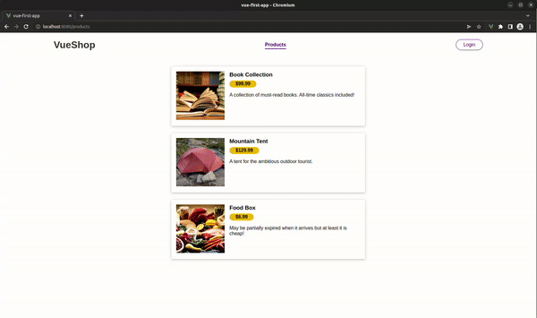

# Vue-Shop



## About The Project

``

### Built with

- Vue Js
- SASS

## Getting Started

### Installation

1. Clone the repository

   ```

   ```

2. Navigate to the directory

   ```

   ```

3. Install dependencies

   ```

   ```

### Compiles and hot-reloads for development

```
npm run serve
```

## Project Structure

```
.
├── README
├──
└── vue-shop # Project files
    ├── src
    |   ├── components
    |   |   ├── cart
    |   |   |   └── CartItem.vue
    |   |   ├── nav
    |   |   |   └── AppHeader.vue
    |   |   ├── products
    |   |   |   └── ProductItem.vue
    |   |   └── ui
    |   |       └── BaseBadge.vue
    |   ├── views
    |   |   ├── PageNotFound.vue
    |   |   ├── ProductsList.vue
    |   |   ├── ShopAdmin.vue
    |   |   └── UserCart.vue
    |   ├── router
    |   |   └── index.js
    |   ├── store
    |   |   ├── modules
    |   |   |   ├── auth
    |   |   |   |   ├── actions.js
    |   |   |   |   ├── mutations.js
    |   |   |   |   ├── getters.js
    |   |   |   |   └── index.js
    |   |   |   ├── cart
    |   |   |   |   ├── actions.js
    |   |   |   |   ├── mutations.js
    |   |   |   |   ├── getters.js
    |   |   |   |   └── index.js
    |   |   |   └── products
    |   |   |       ├── getters.js
    |   |   |       └── index.js
    |   |   └── index.js
    |   ├── App.vue
    |   └── main.js
    ├── .browserslistrc
    ├── .eslintrc.js
    ├── jsconfig.json
    ├── package.json
    ├── package-lock.json
    ├── babel.config.js
    ├── vue.config.js
    ├── node_modules
    └── public
```
